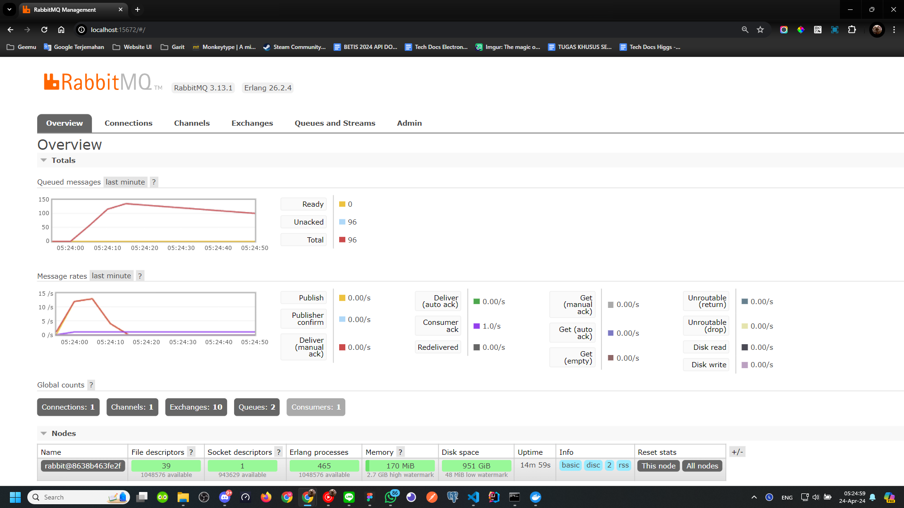

1. What is amqp?
   
  AMQP merupakan singkatan dari Advanced Message Queuing Protocol. AMQP adalah standar terbuka untuk middleware berbasis pesan yang memungkinkan aplikasi berkomunikasi satu sama lain secara asinkron, reliable, dan aman.

2. What it means? guest:guest@localhost:5672 , what is the first quest, and what is the second guest, and what is localhost:5672 is for?  

Pada guest:guest@localhost:5672, guest:guest adalah nama pengguna dan kata sandi yang digunakan untuk mengautentikasi dengan server AMQP. Di RabbitMQ (yang menggunakan AMQP), nama pengguna dan kata sandi default keduanya adalah "guest". localhost:5672 menentukan nama host (dalam kasus ini, localhost, yang berarti mesin lokal pada laptop pribadi) dan nomor port (5672) di mana server AMQP berjalan. Jadi, string ini adalah URL untuk melakukan koneksi ke server RabbitMQ dengan kredensial default.

Simulation slow subscriber (Total queue: 30)
